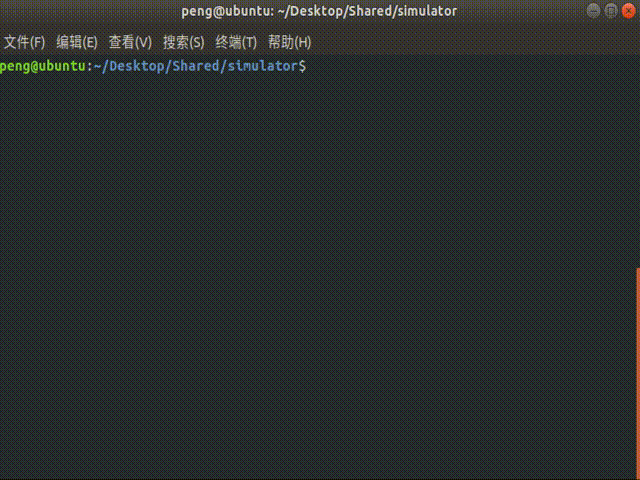

# risc-v simulator

## 1. update log

- [2021/10/08] first commit, main framework done, simple sample code in `main.c`,not fully tested.
- [2021/10/10] GUI almost done, somehow functional.
- [2021/10/24] implement standard risc-v memory structure + disasm.
- [2021/10/24] complete simple assembler without supporting directives and pseudo instructions
- [2021/10/27] change the output code format from text file to binary, all related parts adapted
- [2021/10/30] support some directives and pseudo instructions for assembler
- [2021/10/31] implement instruction analysis
- [2021/11/09] support RV32M and RV32F
- [2021/11/12] have every related parts customized
- [2021/11/19] implement a cache system
- [2021/11/21] visualize the cache structure
- [2021/11/29] implement a branch predictor
- [2021/12/01] improve the interaction of GUI
- [2021/12/05] introduce stall counter and display executing time prediction to analysis window
- [2021/12/12] implement automatic stepping with window updated
- [2021/12/14] implement information dump for simulator
- [2021/12/21] implement uart output for simulator

## 2. how to build

***recommended workflow as well***

- prerequisites
	- gcc
	- ncurses

		> MacOS: supported
		> 
		> Ubuntu: run `sudo apt-get install libncurses5-dev`
	
	- python3.8

- assembler
	- step1: `cd ./asm`
	- step2: check `python3 asm.py -h` for help
	- step3: `python3 asm.py fileName.s`

		> relative path to `.s` file needed
	
	- step4: check outputs in `./bin`

		> `xxd fileName.code` or `hexdump fileName.code` would be helpful
	
- dis-assembler
	- step1: `make disasm`
	- step2: `./disasm fileName`

		> binary code with same file name supposed to be in `./bin`
		>
		> using stdout as output

- simulator

	> customizable settings
	> - Cache (under `src/cache.h`)
	> 	- block size
	> 	- associativity
	>	- page switching policy
	> - Branch Predictor (under `src/branch_predictor.h`)
	> 	- prediction policy
	> 	- size of PHT

	- step1: `make sim`
	- step2: `./sim fileName`

		> binary code with same file name supposed to be in `./bin`
	
	- step3: type `h` for help
	- step4: type `quit` to exit simulator
	- step5: `make clean`

## 3. efficiency

- [2021/12/12] fib 35: 230686620 instructions in 17853138 clk, 12921348.616697 per sec
- [2021/12/21] fib 35: 249141551 instructions in 17645914 clk, 14118937.165850 per sec
